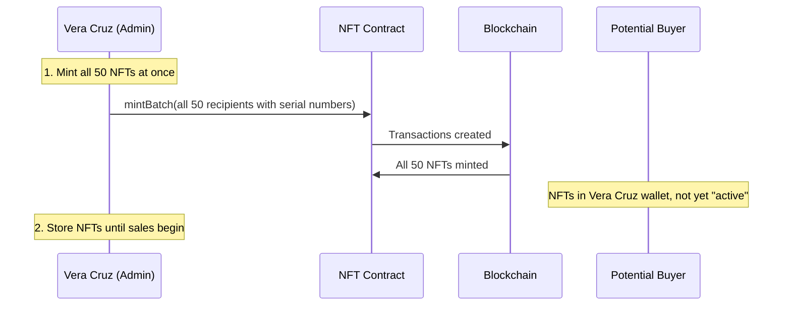
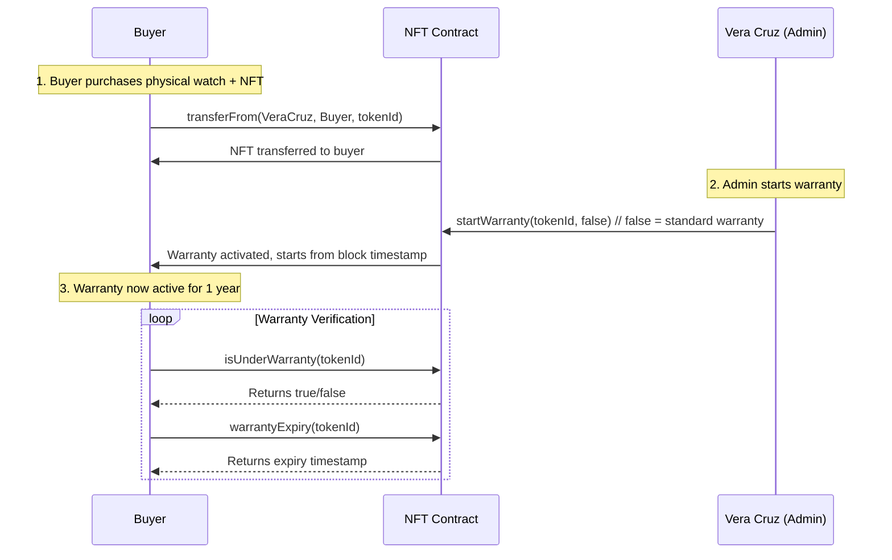
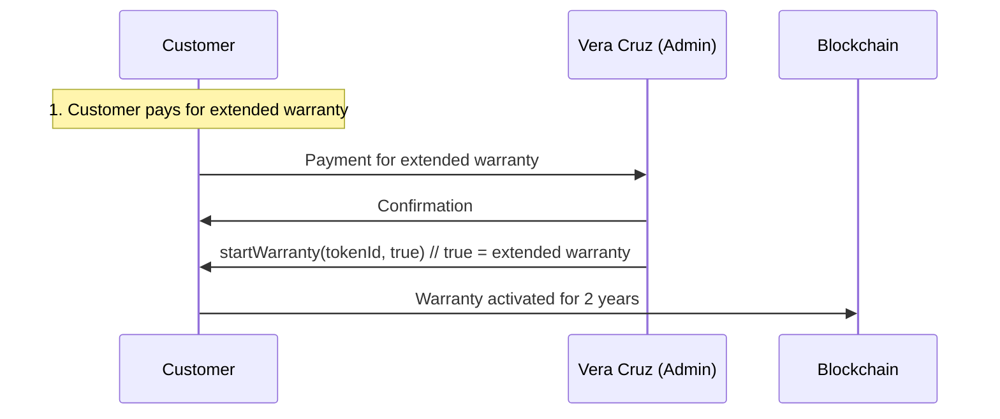

# Vera Cruz NFT - Smart Contract Architecture

## Project Summary

NFT smart contract for the watch brand **Vera Cruz**, model **Alvorada**. Each watch will have a corresponding NFT serving as:
- **Proof of Authenticity** - unique record on the blockchain
- **Extended Warranty** - access to exclusive benefits
- **Future Value** - prevention of counterfeits, appreciation like Rolex

---

## 1. Product Specifications (On-Chain)

### Fixed Watch Data (Minted at creation)

| Field | Type | Description | Example |
|-------|------|-------------|---------|
| `model` | string | Watch model | "Alvorada" |
| `brand` | string | Watch brand | "Vera Cruz" |
| `caseMaterial` | string | Case material | "316L Stainless Steel" |
| `caseDiameter` | string | Case diameter | "40mm" |
| `crystalType` | string | Crystal type | "Sapphire Crystal" |
| `movementType` | string | Movement type | "Quartz" |
| `caliber` | string | Caliber | "Miyota 2115" |
| `strap` | string | Strap type | "Solid Stainless Steel President Style" |
| `waterResistance` | string | Water resistance | "5 ATM" |
| `dialColor` | enum (DialColor) | Dial color | `Black` (0) or `AuroraBlue` (1) |
| `serialNumber` | string | Unique serial number | "VR-AL-AA-01001" |
| `edition` | uint256 | Position in the batch | 1 (1-25) or 1 (1-25) |
| `mintedAt` | uint256 | Minting timestamp | Auto (block timestamp) |

### Serial Number Format

```
VR-AL-AA-01001
│   │  │  │
│   │  │  └── Specific watch number (001-025 within batch)
│   │  └───── Batch number (01 = first batch)
│   └──────── Dial color code:
│              AA = Aurora Blue (Azul Aurora)
│              PR = Black (Preto)
└──────────── Model code:
               AL = Alvorada
Brand code:    VR = Vera Cruz
```

**Examples:**
- `VR-AL-AA-01001` → First Aurora Blue watch of first batch
- `VR-AL-AA-01025` → 25th Aurora Blue watch of first batch
- `VR-AL-PR-01001` → First Black watch of first batch
- `VR-AL-PR-01025` → 25th Black watch of first batch

---

## 2. NFT Structure

### 2.1 Standard
- **ERC-721** (NFT standard) - **CONFIRMED** (each watch has unique serial number on-chain)
- Extensions: `Ownable`, `ERC721URIStorage`, `ReentrancyGuard`

### 2.2 Metadata (Off-Chain via IPFS)

```json
{
  "name": "Vera Cruz Alvorada #1/50",
  "description": "Vera Cruz Alvorada watch - Aurora Blue dial, 40mm, 316L Stainless Steel, Sapphire Crystal, Miyota 2115 Quartz movement. Serial: VR-AL-AA-01001",
  "image": "ipfs://...",
  "external_url": "https://veracruzwatches.com/alvorada/1",
  "attributes": [
    {"trait_type": "Model", "value": "Alvorada"},
    {"trait_type": "Brand", "value": "Vera Cruz"},
    {"trait_type": "Case Material", "value": "316L Stainless Steel"},
    {"trait_type": "Case Diameter", "value": "40mm"},
    {"trait_type": "Crystal", "value": "Sapphire Crystal"},
    {"trait_type": "Movement", "value": "Quartz"},
    {"trait_type": "Caliber", "value": "Miyota 2115"},
    {"trait_type": "Strap", "value": "Solid Stainless Steel President Style"},
    {"trait_type": "Water Resistance", "value": "5 ATM"},
    {"trait_type": "Dial Color", "value": "Aurora Blue"},
    {"trait_type": "Edition", "value": "1/50"},
    {"trait_type": "Serial Number", "value": "VR-AL-AA-01001"}
  ]
}
```

---

## 3. Smart Contract Architecture

### 3.1 Key Design Decisions
- **ERC-721 chosen** because each watch has a unique serial number on-chain
- **Batch minting possible** but warranty starts at first sale
- **Admin-controlled warranty activation** - only Vera Cruz can start the warranty period

### 3.2 Contract Flow Diagram

```
┌─────────────────────────────────────────────────────────────┐
│                    VeraCruzNFT.sol                          │
├─────────────────────────────────────────────────────────────┤
│  Owner Functions (Vera Cruz):                                │
│  ├── mintBatch(address to, uint256[] tokenIds, string[] serials, DialColor[] colors)  │
│  ├── startWarranty(uint256 tokenId, bool extended)          │
│  ├── setBaseURI(string memory newBaseURI)                   │
│  └── pause() / unpause()                                    │
├─────────────────────────────────────────────────────────────┤
│  NFT Owner Functions:                                       │
│  ├── transferFrom(address from, address to, uint256 id)     │
│  ├── safeTransferFrom(address from, address to, uint256 id) │
│  └── setOwnerAlias(uint256 tokenId, string memory alias)    │
├─────────────────────────────────────────────────────────────┤
│  Read-Only Query Functions:                                 │
│  ├── getWatchData(uint256 tokenId) → WatchData              │
│  ├── getOwnershipHistory(uint256 tokenId) → Transfer[]       │
│  ├── getOwnerAlias(address owner) → string                  │
│  ├── getWatchesByOwner(address owner) → uint256[]           │
│  ├── totalSupply() → uint256                                │
│  ├── getWatchesByDialColor(DialColor) → uint256[]           │
│  ├── isUnderWarranty(uint256 tokenId) → bool                │
│  ├── warrantyStartTime(uint256 tokenId) → uint256            │
│  ├── warrantyType(uint256 tokenId) → bool                    │
│  └── getWarrantyExpiry(uint256 tokenId) → uint256            │
└─────────────────────────────────────────────────────────────┘
```

---

## 4. Data Structures

### 4.1 WatchData (struct)

```solidity
enum DialColor { Black, AuroraBlue }

struct WatchData {
    string model;              // "Alvorada"
    string brand;              // "Vera Cruz"
    string caseMaterial;       // "316L Stainless Steel"
    string caseDiameter;       // "40mm"
    string crystalType;        // "Sapphire Crystal"
    string movementType;       // "Quartz"
    string caliber;            // "Miyota 2115"
    string strap;              // "Solid Stainless Steel President Style"
    string waterResistance;    // "5 ATM"
    DialColor dialColor;       // Black (0) or AuroraBlue (1)
    string serialNumber;       // "VR-AL-AA-01001"
    uint256 edition;           // 1-25 (position within dial color batch)
    uint256 mintedAt;          // Block timestamp of minting
    bool warrantyActive;       // Is warranty currently active?
    uint256 warrantyStart;     // When warranty was started (0 if not started)
    bool extendedWarranty;     // True if extended warranty purchased
}
```

### 4.2 TransferRecord (struct)

```solidity
struct TransferRecord {
    address from;              // Sender address
    address to;                // Recipient address
    uint256 timestamp;         // Block timestamp of transfer
    string fromAlias;          // Sender's pseudonym (optional)
    string toAlias;            // Recipient's pseudonym (optional)
    bool warrantyTransferred;  // Does warranty transfer with NFT?
}
```

### 4.3 OwnerProfile (struct)

```solidity
struct OwnerProfile {
    string alias;              // User-chosen pseudonym
    uint256 aliasUpdatedAt;    // Last alias update timestamp
    bool hasExtendedWarranty;  // Does this owner have extended warranty?
}
```

### 4.4 WarrantyState (enum)

```solidity
enum WarrantyState {
    None,          // Warranty not started
    ActiveStandard, // Standard 1-year warranty active
    ActiveExtended, // Extended 2-year warranty active
    Expired        // Warranty period ended
}
```

---

## 5. Operation Flow

### 5.1 Minting Phase (Admin only)



### 5.2 Warranty Activation Phase (After First Sale)



### 5.3 Extended Warranty Purchase



---

## 6. LGPD Compliance

### 6.1 What is NOT stored
- ❌ Full name
- ❌ CPF/CNPJ (Brazilian tax ID)
- ❌ Residential address
- ❌ Email
- ❌ Phone number

### 6.2 What IS stored
- ✅ Wallet address (public by blockchain design)
- ✅ Pseudonym/alias (user-chosen, optional)
- ✅ Transaction timestamps (automatic)
- ✅ Product data (non-personal)

### 6.3 Data Protection
- Wallet addresses are not personal data (they are pseudonymous)
- Alias is optional and chosen by the user themselves
- Product data does not identify individuals
- No personal information is stored on-chain

---

## 7. Security

### 7.1 Permissions

| Function | Who can execute |
|----------|----------------|
| `mintBatch` | Only the contract owner (Vera Cruz) |
| `startWarranty` | Only the contract owner (Vera Cruz) |
| `setBaseURI` | Only the contract owner |
| `pause` / `unpause` | Only the contract owner |
| `transferFrom` | Current NFT owner (or approved) |
| `setOwnerAlias` | Current NFT owner |
| `isUnderWarranty` | Anyone (read-only) |
| `getWatchData` | Anyone (read-only) |

### 7.2 Security Measures
- `Ownable` contract for administrative control
- `ReentrancyGuard` on state-changing functions
- `Pausable` mechanism for emergency stops
- Token existence validation
- Events for auditing all operations
- Zero address checks (0x0000...)

---

## 8. Events

```solidity
event WatchMinted(
    uint256 indexed tokenId,
    address indexed to,
    string serialNumber,
    DialColor dialColor,
    uint256 edition
);

event OwnershipTransferred(
    uint256 indexed tokenId,
    address indexed from,
    address indexed to,
    string fromAlias,
    string toAlias,
    uint256 timestamp
);

event OwnerAliasUpdated(
    uint256 indexed tokenId,
    address indexed owner,
    string oldAlias,
    string newAlias
);

event WarrantyStarted(
    uint256 indexed tokenId,
    address indexed owner,
    bool extendedWarranty,
    uint256 startTime
);

event WarrantyExpired(
    uint256 indexed tokenId,
    address indexed formerOwner
);
```

---

## 9. Smart Contract Code Structure (Preview)

```solidity
// SPDX-License-Identifier: MIT
pragma solidity ^0.8.20;

import "@openzeppelin/contracts/token/ERC721/extensions/ERC721URIStorage.sol";
import "@openzeppelin/contracts/access/Ownable.sol";
import "@openzeppelin/contracts/security/Pausable.sol";
import "@openzeppelin/contracts/security/ReentrancyGuard.sol";

contract VeraCruzNFT is ERC721URIStorage, Ownable, Pausable, ReentrancyGuard {
    
    enum DialColor { Black, AuroraBlue }
    enum WarrantyState { None, ActiveStandard, ActiveExtended, Expired }
    
    struct WatchData {
        string model;
        string brand;
        string caseMaterial;
        string caseDiameter;
        string crystalType;
        string movementType;
        string caliber;
        string strap;
        string waterResistance;
        DialColor dialColor;
        string serialNumber;
        uint256 edition;
        uint256 mintedAt;
        bool warrantyActive;
        uint256 warrantyStart;      // Block timestamp when started
        bool extendedWarranty;      // True if extended
    }
    
    struct TransferRecord {
        address from;
        address to;
        uint256 timestamp;
        string fromAlias;
        string toAlias;
        bool warrantyTransferred;
    }
    
    struct OwnerProfile {
        string alias;
        uint256 aliasUpdatedAt;
        bool hasExtendedWarranty;
    }
    
    // State
    uint256 private _nextTokenId = 1;
    uint256 public constant MAX_SUPPLY = 50;
    uint256 public constant STANDARD_WARRANTY_YEARS = 1;
    uint256 public constant EXTENDED_WARRANTY_YEARS = 2;
    
    mapping(uint256 => WatchData) public watchData;
    mapping(uint256 => TransferRecord[]) public ownershipHistory;
    mapping(address => OwnerProfile) public ownerProfiles;
    mapping(address => uint256[]) public ownerWatches;
    mapping(DialColor => uint256[]) public watchesByDialColor;
    mapping(uint256 => WarrantyState) public warrantyStates;
    
    // Events
    event WatchMinted(uint256 indexed tokenId, address indexed to, string serialNumber, DialColor dialColor, uint256 edition);
    event OwnershipTransferred(uint256 indexed tokenId, address indexed from, address indexed to, string fromAlias, string toAlias, uint256 timestamp);
    event OwnerAliasUpdated(uint256 indexed tokenId, address indexed owner, string oldAlias, string newAlias);
    event WarrantyStarted(uint256 indexed tokenId, address indexed owner, bool extendedWarranty, uint256 startTime);
    event WarrantyExpired(uint256 indexed tokenId, address indexed formerOwner);
    
    constructor() ERC721("Vera Cruz Alvorada", "VCRZ-ALV") Ownable(msg.sender) {}
    
    function mintBatch(
        address to,
        string memory serialNumber,
        DialColor dialColor,
        uint256 edition
    ) public onlyOwner whenNotPaused nonReentrant {
        require(_nextTokenId <= MAX_SUPPLY, "Max supply reached");
        require(to != address(0), "Invalid recipient");
        require(bytes(serialNumber).length > 0, "Serial number required");
        
        uint256 tokenId = _nextTokenId;
        _nextTokenId++;
        
        WatchData memory data = WatchData({
            model: "Alvorada",
            brand: "Vera Cruz",
            caseMaterial: "316L Stainless Steel",
            caseDiameter: "40mm",
            crystalType: "Sapphire Crystal",
            movementType: "Quartz",
            caliber: "Miyota 2115",
            strap: "Solid Stainless Steel President Style",
            waterResistance: "5 ATM",
            dialColor: dialColor,
            serialNumber: serialNumber,
            edition: edition,
            mintedAt: block.timestamp,
            warrantyActive: false,
            warrantyStart: 0,
            extendedWarranty: false
        });
        
        watchData[tokenId] = data;
        watchesByDialColor[dialColor].push(tokenId);
        
        _safeMint(to, tokenId);
        
        emit WatchMinted(tokenId, to, serialNumber, dialColor, edition);
    }
    
    function startWarranty(uint256 tokenId, bool extended) public onlyOwner whenNotPaused {
        require(watchData[tokenId].warrantyActive == false, "Warranty already active");
        require(tokenId > 0 && tokenId <= totalSupply(), "Invalid token");
        
        uint256 startTime = block.timestamp;
        warrantyStates[tokenId] = extended ? WarrantyState.ActiveExtended : WarrantyState.ActiveStandard;
        
        watchData[tokenId].warrantyActive = true;
        watchData[tokenId].warrantyStart = startTime;
        watchData[tokenId].extendedWarranty = extended;
        
        // Update owner profile
        address owner = ownerOf(tokenId);
        OwnerProfile storage profile = ownerProfiles[owner];
        profile.hasExtendedWarranty = extended;
        
        emit WarrantyStarted(tokenId, owner, extended, startTime);
    }
    
    function isUnderWarranty(uint256 tokenId) public view returns (bool) {
        require(watchData[tokenId].warrantyActive, "Watching data not found");
        return warrantyStates[tokenId] != WarrantyState.Expired;
    }
    
    function warrantyExpiry(uint256 tokenId) public view returns (uint256) {
        require(watchData[tokenId].warrantyActive, "Warranty data not found");
        uint256 years = watchData[tokenId].extendedWarranty ? EXTENDED_WARRANTY_YEARS : STANDARD_WARRANTY_YEARS;
        return watchData[tokenId].warrantyStart + years * 365 days;
    }
    
    // ... additional functions
}
```

---

## 10. Implementation Timeline

### Phase 1: Development
- [ ] Create Hardhat/Foundry project structure
- [ ] Implement `VeraCruzNFT.sol` contract with warranty features
- [ ] Write unit tests (minting, warranty activation, transfers)
- [ ] Create deployment script

### Phase 2: Preparation
- [ ] Prepare images of all 50 watches (IPFS)
- [ ] Prepare JSON metadata for each NFT
- [ ] Configure IPFS via Pinata or use OpenSea
- [ ] Test on testnet (Sepolia)

### Phase 3: Deployment
- [ ] Audit contract (pay special attention to warranty functions)
- [ ] Deploy to mainnet
- [ ] Mint all 50 NFTs
- [ ] Configure marketplace (OpenSea)
- [ ] Set up warranty tracking dashboard (off-chain)

---

## 11. Suggested Tech Stack

| Component | Technology |
|-----------|------------|
| Blockchain | Ethereum (L1) or Polygon (L2 cheaper) |
| Testnet | Sepolia (Ethereum) or Mumbai (Polygon) |
| Framework | Hardhat or Foundry |
| Library | OpenZeppelin Contracts |
| Storage | IPFS via Pinata or OpenSea |
| Marketplace | OpenSea |
| Warranty Dashboard | Off-chain service (The Graph, or custom backend) |

---

## 12. Next Steps

1. **Confirm this plan** - Review proposed architecture with warranty features
2. **Choose blockchain** - Ethereum mainnet vs Polygon (cost vs speed consideration)
3. **Implement code** - Switch to "Code" mode to write Solidity
4. **Test** - Deploy to testnet, test warranty activation flow
5. **Final deploy** - Mainnet

---

*Document generated in Architect mode for the Vera Cruz NFT project*
